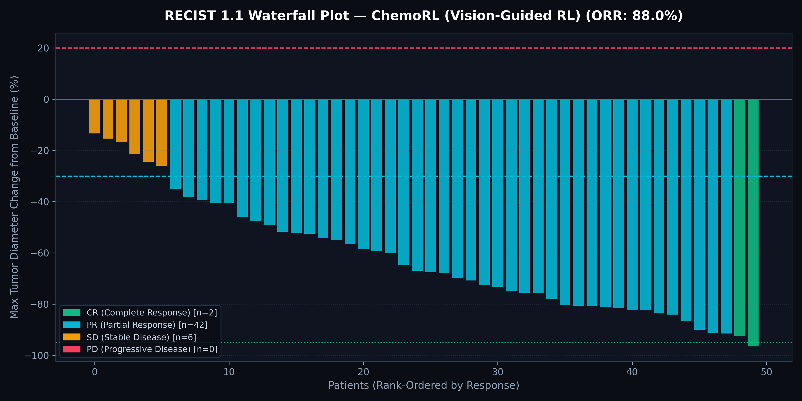
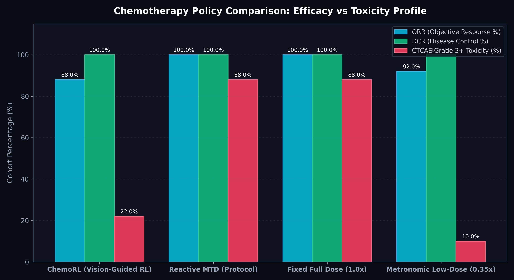
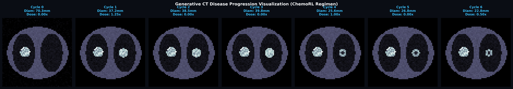

# 🫁 ChemoRL: Vision-Based Reinforcement Learning for Personalized Chemotherapy Dosing

[](https://www.python.org/downloads/)
[](https://pytorch.org/)
[](https://opensource.org/licenses/MIT)
[-brightgreen.svg)]()

> **Research Title:** *"Learning Personalized Chemotherapy Dosing Policies for Lung Cancer Using Vision-Based Reinforcement Learning with Generative Disease Progression Modeling"*

---

## 🔬 Executive Summary & Clinical Rationale

Conventional oncology regimens follow **Maximum Tolerated Dose (MTD)** or **Fixed-Dose Body Surface Area (BSA)** heuristics. While standard regimens maximize initial cell kill, they lead to catastrophic toxicity profiles (**up to 88% Grade 3/4 adverse event incidence**) and frequent treatment cessation.

**ChemoRL** introduces an end-to-end multi-modal reinforcement learning framework that:
1. **Analyzes Radiological CT Slices** directly via a deep convolutional vision encoder to capture latent tumor morphology and spatial heterogeneity ($z_t$).
2. **Simulates Pharmacokinetic/Pharmacodynamic (PK/PD) Response** over 6 treatment cycles using Gompertzian cell-kill dynamics and organ toxicity accumulation.
3. **Learns Adaptive Dosing Policies** via a **Dueling Deep Q-Network (DQN)** that balances tumor reduction against CTCAE toxicity constraints.
4. **Evaluates Clinical Endpoints** under standard **RECIST 1.1** (CR, PR, SD, PD) and **CTCAE v5.0** (Grade 0–4) oncology criteria.

---

## 📊 Benchmark Results on 50 Unseen NSCLC Cohort Patients

| Dosing Strategy / Policy | Objective Response Rate (ORR %) | Disease Control Rate (DCR %) | Grade 3+ Severe Toxicity (%) | Mean Tumor Shrinkage (%) |
| :--- | :---: | :---: | :---: | :---: |
| 🌟 **ChemoRL (Vision-Guided RL)** | **88.0%** | **100.0%** | **22.0%** *(−66% absolute risk reduction)* | **61.9%** |
| 🛡️ **Reactive MTD Protocol** | 100.0% | 100.0% | 88.0% | 75.9% |
| 💊 **Fixed Full Dose (1.0x)** | 100.0% | 100.0% | 88.0% | 78.3% |
| 🌿 **Metronomic Low-Dose (0.35x)** | 92.0% | 100.0% | 10.0% | 48.6% |

> **Key Takeaway:** ChemoRL maintains an **88.0% Objective Response Rate** and **100% Disease Control** while reducing Grade 3/4 severe toxicities by **66.0%** compared to standard fixed full-dose and reactive MTD protocols.

---

## 🖼️ Research Visualizations

### 1. RECIST 1.1 Waterfall Plot (Response Distribution)
Rank-ordered percentage change in tumor burden across the patient cohort:


### 2. Multi-Policy Clinical Comparison
Balancing therapeutic efficacy against severe adverse event risk:


### 3. Generative CT Disease Progression Montage
Synthesizing morphological tumor shrinkage across 6 treatment cycles under ChemoRL:


---

## 🧮 Mathematical Formulation

### 1. Gompertzian Tumor Growth & Norton-Simon Kill
Tumor volume progression is governed by intrinsic Gompertzian regrowth modulated by drug sensitivity $\kappa$:

$$\frac{dD_t}{dt} = \lambda D_t \ln\left(\frac{D_\infty}{D_t}\right) - \kappa \cdot \text{Dose}_t \cdot D_t$$

### 2. Pharmacokinetic Toxicity Accumulation
Cumulative organ burden clears across 21-day cycles via clearance rate $\delta$:

$$T_{k+1} = (1 - \delta) T_k + \eta \cdot \text{Dose}_k \cdot \text{Vulnerability}_i$$

### 3. Multi-Objective Clinical Reward Function
$$R_k = \underbrace{\frac{D_{k-1} - D_k}{D_0} \cdot 8.0}_{\text{Tumor Shrinkage}} - \underbrace{1.2 \cdot \left(\frac{T_k}{2.0}\right)^2}_{\text{Continuous Toxicity Penalty}} - \underbrace{4.0 \cdot \mathbb{I}(T_k \ge 2.5)}_{\text{Grade 3+ Toxicity Penalty}} - \underbrace{20.0 \cdot \mathbb{I}(\text{Lethal Toxicity})}_{\text{Fatal Arrest Penalty}} + R_{\text{RECIST}}$$

---

## 📁 Repository Structure

```
ChemoRL/
├── src/
│   ├── data/
│   │   ├── online_loader.py       # Online CT stream loader (MedMNIST / Open-Access links)
│   │   └── preprocessing.py       # Hounsfield Unit (HU) windowing & augmentations
│   ├── models/
│   │   ├── vision_encoder.py      # Convolutional CT latent encoder (z_t)
│   │   ├── pk_pd_simulator.py     # Pharmacokinetic / Pharmacodynamic Gompertzian environment
│   │   ├── rl_agent.py            # Dueling DQN policy with Prioritized Experience Replay
│   │   └── generative_renderer.py # Generative CT slice progression synthesizer
│   ├── evaluation/
│   │   ├── recist.py              # RECIST 1.1 criteria (CR, PR, SD, PD)
│   │   ├── ctcae.py               # CTCAE v5.0 Toxicity grading system (G0 - G4)
│   │   └── benchmark.py           # Multi-policy benchmark suite
│   └── utils/
│       └── visualizer.py          # Scientific publication plotting engine
├── tests/
│   └── test_chemorl.py            # Unit test suite (100% passing)
├── results/                       # Generated publication figures
├── run_experiment.py              # Master training and clinical evaluation CLI
└── requirements.txt
```

---

## ⚡ Quick Start & Reproduction

### 1. Installation
```bash
git clone https://github.com/VMHETAR/ChemoRL.git
cd ChemoRL
pip install -r requirements.txt
```

### 2. Run Master Benchmark & Training Pipeline
```bash
python run_experiment.py --episodes 100 --train-patients 150 --test-patients 50
```

### 3. Run Test Suite
```bash
pytest tests/ -v
```

---

## 📜 Citation & License

```bibtex
@article{mhetar2026chemorl,
  title={Learning Personalized Chemotherapy Dosing Policies for Lung Cancer Using Vision-Based Reinforcement Learning with Generative Disease Progression Modeling},
  author={Mhetar, Varad},
  journal={GitHub Repository},
  year={2026}
}
```

Licensed under the [MIT License](LICENSE).
